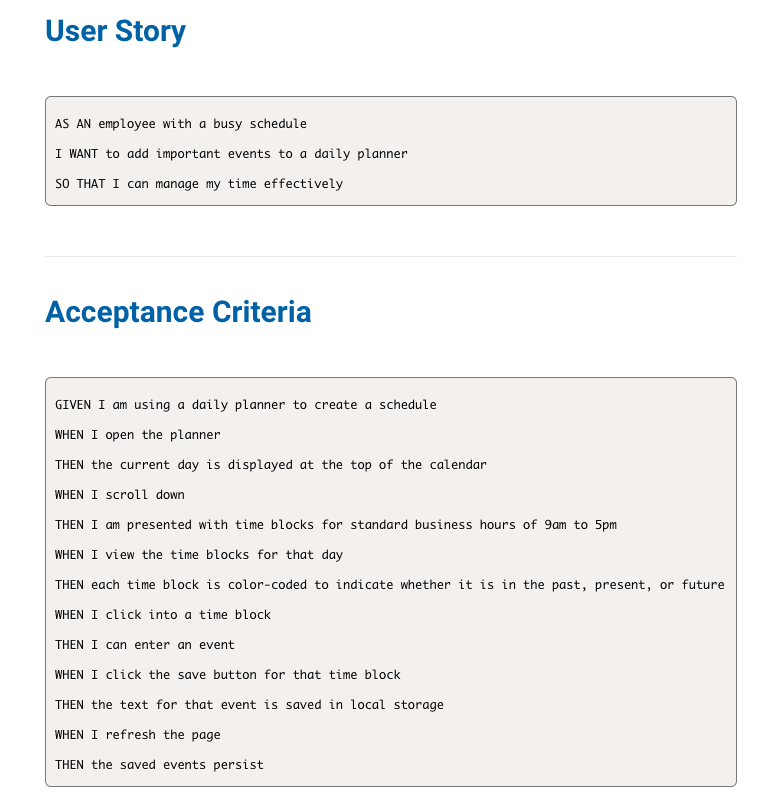
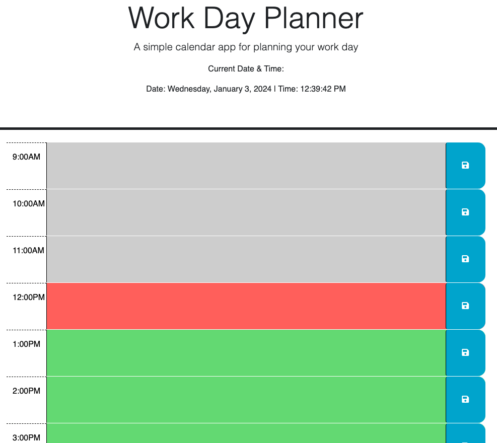

# Work-Day-Planner
Plan your day, Dont't waste your time!

## Description 

This application/webpage is created to plan your work day and track your scheduled events. 
Below you can find the User Story and the Acceptance criteria required to complete the application. 

This is an example of how the application will look like. 

## Features

In the header of the page you will see the current date and time. This function is displayed by using the Days.js library.

Below you will see the time blocks from 9:00AM to 5:00PM, the blocks can be displayed in three different colors. The past time will be grey, current time is red and future time is green. 
Next to the time blocks you can find the save button, when you click to the button you can save your input/text/event message to your localStorage. When the page is refreshed your saved text/event will be persistent. 

This application runs in the browser and features dynamically updated HTML and CSS powered by jQuery.

This application includes the following file structure: 

HTML page - index.html
CSS page - styles.css
JavaScript page - script.js
Images folder. 

## Summary

The Work-Day-Planner app will be your biggest helper in planning your work day. This application features save the time slot so you can keep tracking and manage your time without delays. Starting from 9:00AM to 5:00PM you will be able to see and manage your appointments or events during the day. 

 

## Deployment Link

https://dileknrdn.github.io/work-day-planner/ 

## Author 

Dilek Nuredin 

https://github.com/dileknrdn 
<<<<<<< HEAD
=======

>>>>>>> d619cb9 (added depoyment link to readme file)
